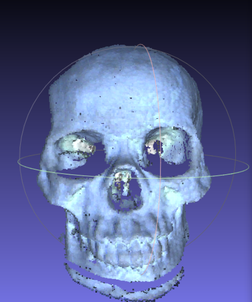

# Voxel-Reconstruction
Course Project of Intelligent Acquisition of Visual Information (浙江大学智能视觉信息采集课程大作业)

## Introduction

This project can reconstruct the voxel model of opaque objects.

Results:

    

    

## Setup

- Create python environment with dependencies:
  - PyTorch
  - Trimesh
  - Open3D
  - Tqdm
  - PyMeshLab
  - OpenCV
- Install [OptiX 6.5.0](https://developer.nvidia.com/designworks/optix/downloads/legacy)
- Change the paths in `Carving.ipynb` to your data directory, and run the code.

## Visualization

To visualize the output of our system, install [MagicaVoxel](https://ephtracy.github.io/).

## Method

0. Devices
   - Camera x1
   - Projector x1
   - Turnable x1

1. Camera-Projector-Turnable Calibration

   

   

2. Capturing

   Place the object on the turnable and capture photos from different views.

3. Silhouette Extraction

   Various methods can be used to extract the silhouettes. For example, change the background color and capture another photo; or use [U2Net](https://github.com/xuebinqin/U-2-Net).

   

4. Carving Coarse Model

   Use the silhouettes extracted in the previous step to carve the coarse model.

   

5. Computing Depth Map from Structural Light Projection

   Compute the depth map according to the photos with structural light projection. Get the point cloud in 3D space according to the depth map.

   

6. 2nd Carving

   Delete the voxels **behind** the point clouds computed in the previous step.

7. Color

   We use ray casting algorithm to assign colors to voxels.

   
